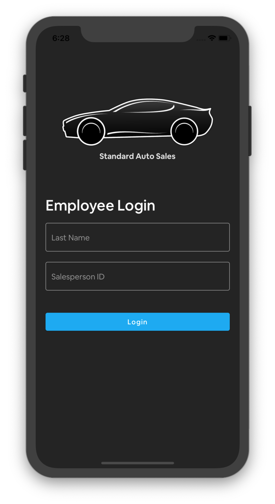
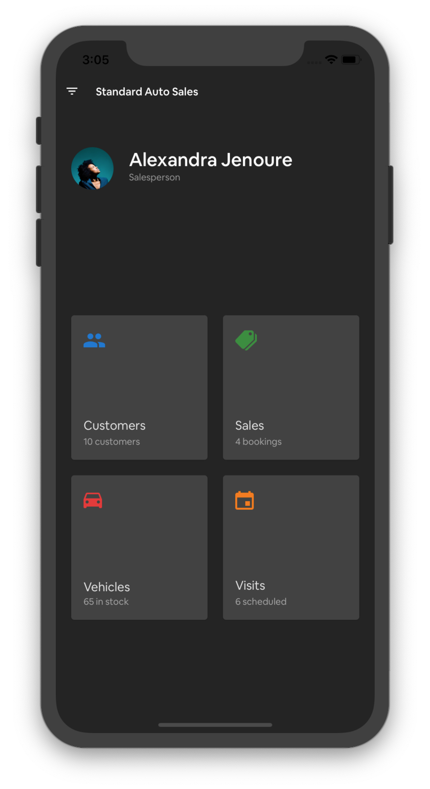
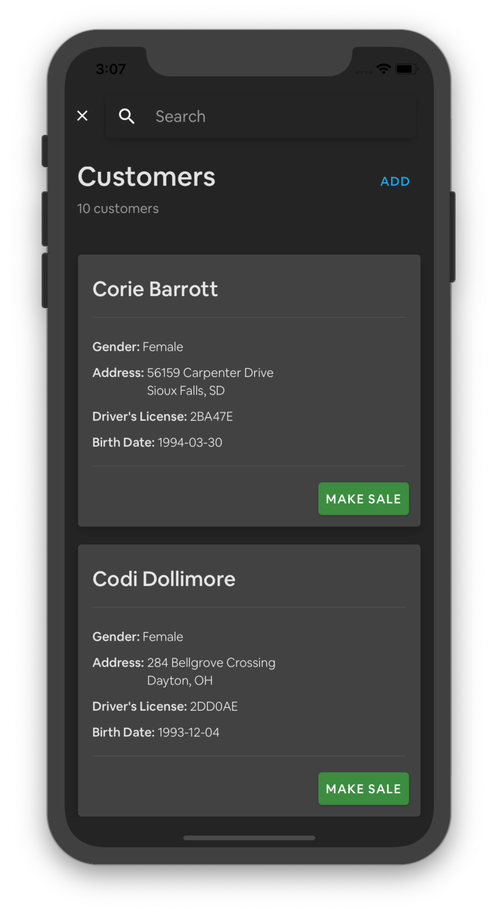
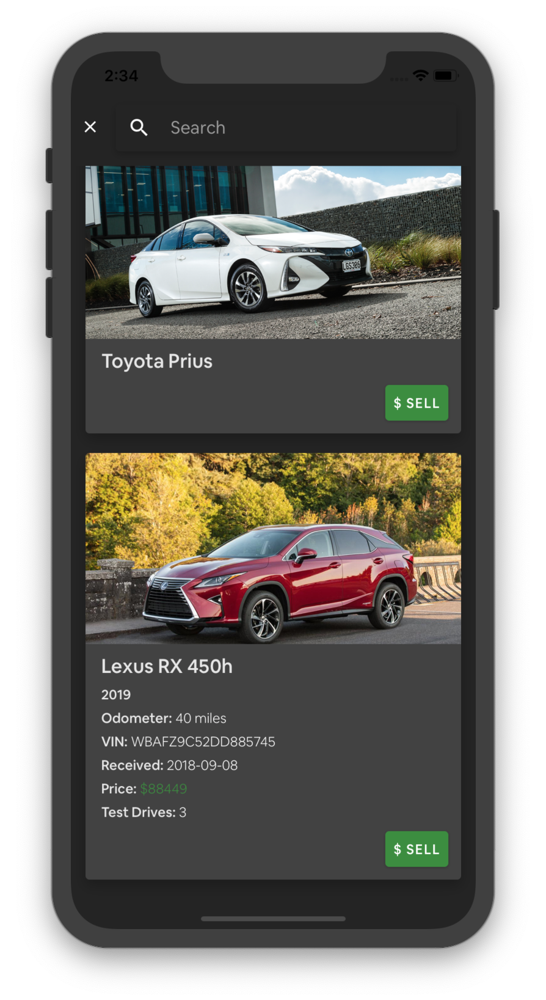
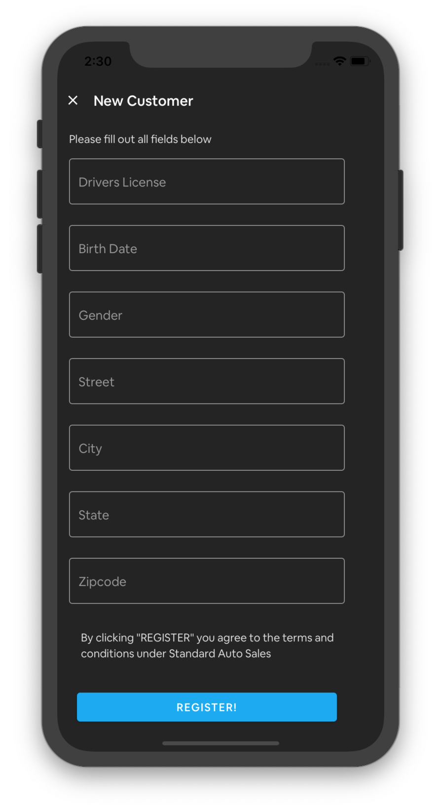
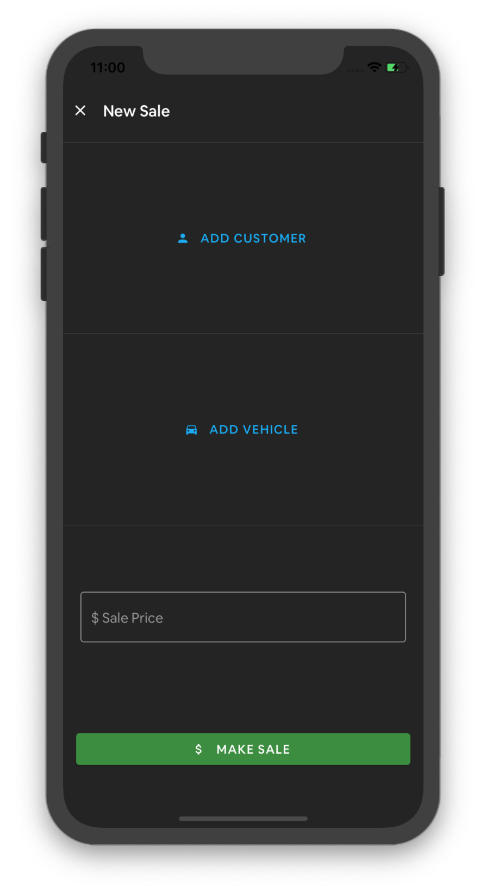
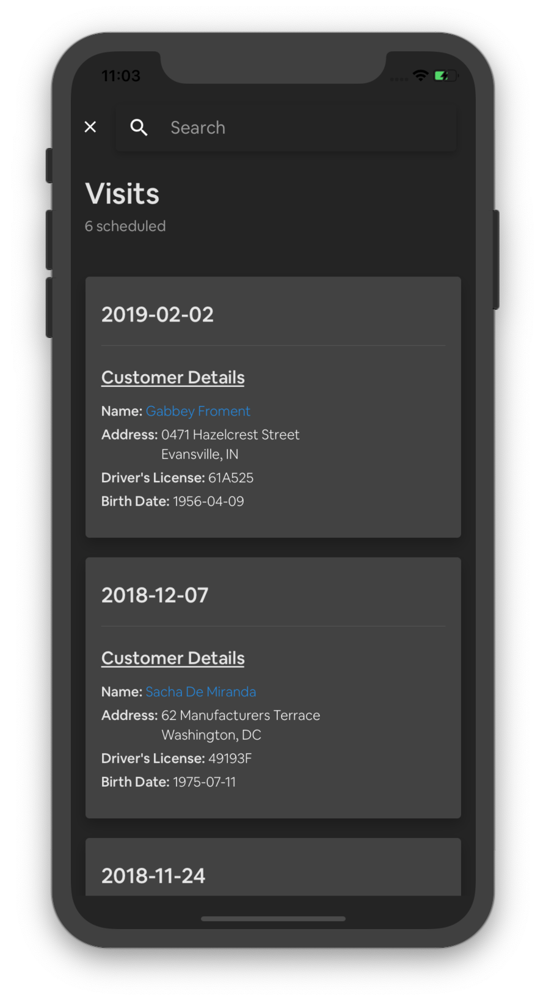
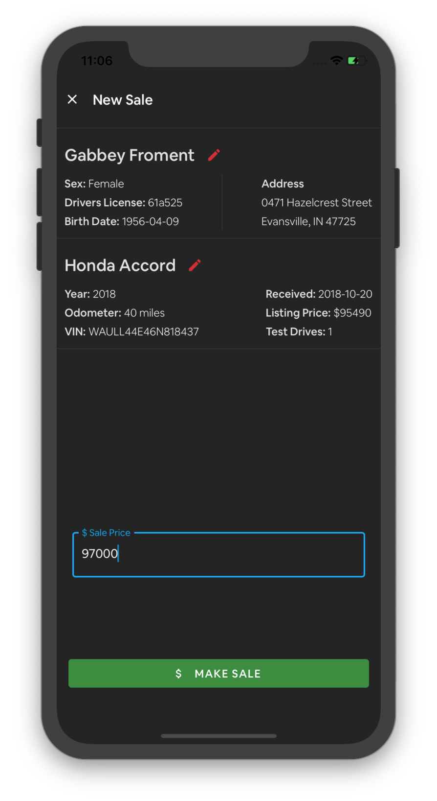
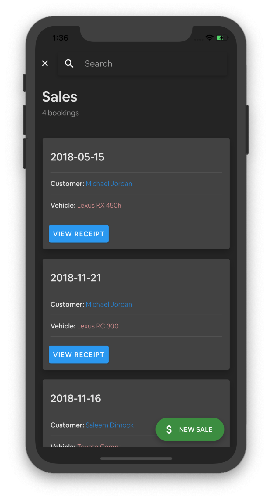

# Standard Auto Sales

A mobile application which assists with the day-to-day tasks of salespeople working for [Standard Auto Sales](https://www.standardcarsales.com)

## Screenshots

   
   
   

   
   
   

   
   
   

## Built With

* [React Native](https://facebook.github.io/react-native/) - The mobile application framework used
* [React Native Paper](https://reactnativepaper.com) - UI Library
* [Expo](https://expo.io) - Toolchain built around React Native
* [Redux](https://redux.js.org) - State management library

## Authors

* **Joshua Cancellier** - [Personal Website](https://jcancellier.github.io)

## License

This project is licensed under the MIT License - see the [LICENSE](LICENSE) file for details
